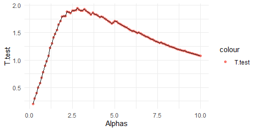

```{r setup, include=FALSE}
knitr::opts_chunk$set(echo = TRUE)
```

```{r,warning=FALSE,message=FALSE}
library(readxl)
library(ggplot2)
library(boot)
```
## Assignment 1 :Hypothesis testing

**In 1970, the US Congress instituted a random selection process for the military draft. All 366 possible birth dates were placed in plastic capsules in a rotating drum and were selected one by one. The first date drawn from the drum received draft number one, the second date drawn received draft number two, etc. Then, eligible men were drafted in the order given by the draft number of their birth date**

**1.** Make a scatterplot of $Y$ versus $X$.

```{r,warning=FALSE,message=FALSE}
library(ggplot2)
set.seed(12345)

# 1.1
Data <-read.csv2("lottery.csv")
ggplot(Data, aes(x=Day_of_year, y = Draft_No)) + geom_point(color='firebrick4') +
  ggtitle(" Day_of_year vs  Draft_No")+theme_minimal()
```
From the plot, the data looks random as it has scattered through the space and we can not observe a pattern in the data.

**2.** Compute an estimate of $\hat{Y}$ .

```{r,warning=FALSE,message=FALSE}
ggplot(Data, aes(x=Day_of_year, y = Draft_No)) +
  geom_point(color='firebrick4') +
  geom_smooth(method = loess) +
  ggtitle(" Day_of_year vs  Draft_No")+theme_minimal()
```

We observe a slightly decreasing general trend in the data, so our initial assumption that the data is random might be not be correct.In the following, we examine our hypothesis about the data being random.

**3.** Check whether the lottery is random, use T-test statistics.

```{r, message=FALSE,warning=FALSE}
library ("boot")
set.seed(12345)
Data <-read.csv2("lottery.csv")
stat1 <- function(data, vn) {
  
  data1 <- data[vn,]
  
  y <- data1$Draft_No
  x <- data1$Day_of_year
  
  res<- loess(Draft_No ~ Day_of_year, data = data1)
  y_hat <- res$fitted
  temp2 <- (y_hat[which.max(y)] - y_hat[which.min(y)])
  temp3 <- (x[which.max(y)] - x[which.min(y)])
  return( temp2 / temp3 )
  
}

B <- 2000
res <- boot(Data, stat1, R = B)
mean_T.test <- mean(res$t)
pvalue<- sum(res$t>0)/B
cat("T test is about: ",mean_T.test,"and pvalue is about: ",pvalue,'\n')
plot(res)  
```
The mean of the T-statistics is around $-0.25$, this value is significantly lesser than zero and from the plot we can see that T- distribution is slightly skewed. A negative t-value indicates a reversal in the directionality of the effect meaning the lottery is random. However, we calculated The p-value and it is around $0.056$. The p-value is slightly greater
than $0.05$,hence there is a chance to reject our null hypothesis.

we should have more evidence to support our hypothesis about randomness of the data.

**4.**  Tests the hypothesis by permutation test.

### Probelem setting  

- $H_0$: Lottery is random
- $H_1$: Lottery is non–random

```{r warning=FALSE,message=FALSE}
#1.4
# according to slide 13
data1 = read.csv2("lottery.csv")

f2.permutation <- function(data1,B=2000){
  data1 = read.csv2("lottery.csv")
  set.seed(12345)
  
  stats1 <- function(data, vn) {
    
    data1 <- data[vn,]
    
    y <- data1$Draft_No
    x <- data1$Day_of_year
    
    res<- loess(Draft_No ~ Day_of_year, data = data1)
    y_hat <- res$fitted
    temp2 <- (y_hat[which.max(y)] - y_hat[which.min(y)])
    temp3 <- (x[which.max(y)] - x[which.min(y)])
    return( temp2 / temp3 )
    
  }
  f1.permutation <- function(B, data1){
    n = dim(data1)[1]
    stat = numeric(B)
    for(b in 1:B){
      Gb = sample(data1$Day_of_year, n)
      newdata <- data1
      newdata$Day_of_year <- Gb
      stat[b] <- stats1(newdata,1:n)
    }
    return(stat)
  }
  
  stat <- f1.permutation(B, data1)
  stat0 <- stats1(data1,1:nrow(data1))
  estimated_p_value <- mean((abs(stat))>(abs(stat0)))
  return(c(stat0,estimated_p_value))
}
f2.permutation(data1,B=2000)
```
The P-value is `round(f2.permutation(data1,B=2000)[2],3)`. This gives us enough evidence to support our null hypothesis and we can not reject the hypothesis that the lottery is random. 

**5.** a crude estimate of the power of the test constructed in Step 4.

### 1.5
a) Generate (an obviously non-random) dataset with $n = 366$ observations by using same X as in the original data set and $Y(x) = \max(0, \min(\alpha x + \beta, 366)), \; \; \; \text{ where } \alpha = 0.1 \text{ and } \beta \sim N(183, \sigma = 10)$

```{r, message=FALSE,warning=FALSE}
# 1.5
#a)
#settings
Data <- read.csv2("lottery.csv")
n <- 366
X <- Data$Day_of_year
set.seed(12345)
beta<-rnorm(n,183,sd = 10)
alpha <- 0.1
#creat Y 
Y <- c(length(X))

Y <- sapply(1:n,FUN = function(i){
  max(0, min(alpha*X[i]+beta[i], n))
  })

```
### b) Plug these data into the permutation test with B = 200 and note whether it was rejected.

```{r,message=FALSE,warning=FALSE}
#b)
Y<-as.data.frame(Y)
nwdata<-data.frame(X,Y)
colnames(nwdata) <- c("Day_of_year","Draft_No")
res5<-f2.permutation(data1 = nwdata,B = 200)
names(res5) <- c('t','p-value')
cat('the T test is: ',res5[1]," and the p-value is : ",res5[2],'\n')
print("The null hypothesis is rejected.")

```
p-values here is smaller than 0.05 and t-Test is larger than 0, so we reject the null hypothesis( $H_0$). The result is reasonable since our data was not random.

### c) Repeat Steps 5a-5b for 
$\alpha = 0.2, 0.3, . . . , 10$.

```{r,message=FALSE,warning=FALSE}
seq_alpha <- seq(0.2,10,by = 0.1)

Q1.c <- function(seq_alpha){
  #settings
  Data <- read.csv2("lottery.csv")
  n <- 366
  X <- Data$Day_of_year
  set.seed(12345)
  beta<-rnorm(n,183,sd = 10)
  alpha <- seq_alpha
  #creat Y 
  Y <- c(length(X))
  
  Y <- sapply(1:n,FUN = function(i){
    max(0, min(alpha*X[i]+beta[i], n))
  })
  
  #b)
  Y<-as.data.frame(Y)
  nwdata<-data.frame(X,Y)
  colnames(nwdata) <- c("Day_of_year","Draft_No")
  res5<-f2.permutation(data1 = nwdata,B = 200)
  names(res5) <- c('t','p-value')
  
  return(res5)
}

temp1 <- c()
temp2<- c()
for (i in 1:length(seq_alpha)) {
  
  temp1[i]<-Q1.c(seq_alpha[i])[1]
  temp2[i]<-Q1.c(seq_alpha[i])[2]
  
}


```
```{r, message=FALSE,warning=FALSE,include=FALSE,fig.show='hide'}
df <- data.frame(Alphas = seq_alpha, T.test = temp1)

ggplot(df, aes(x = Alphas, y = T.test)) +
  geom_point(aes(col=" t-statistic")) +
  geom_line() + theme_minimal()
```



The Value of T test is always greater than zero and the p-value is always 
less than $<0.05$ so the null hypothesis is rejected. The data is not random.

The plot of T-statics is skewed, which shows data random

```{r,message=FALSE,warning=FALSE}
plot(seq_alpha, (1-temp2),ylim = 0:1,xlab = 'Power',ylab = 'alpha')
```
we can see the power of T statics is high and it is perfectly capable of detecting the lack of randomness in the data.
## Assignment 2: Bootstrap, jackknife and confidence intervals

**1.** Plot the histogram of Price

```{r}
data = read_xls("prices1.xls")

ggplot(data = data, aes(Price)) +
  ggtitle("Histogram of Price") +
  geom_histogram(bins = 30)
```

It reminds us of Gamma distribution as it is skewed towards the right.

```{r}
cat(paste("Mean price is:", mean(data$Price)))
```

**2.** Bootstrap

Bias corrected mean estimate

$$\hat{T} = 2T(D)-\frac{1}{B}\sum_{i=1}^{B}T(D_i^*) $$
Variance

$$ \hat{Var[T(.)]} = \frac{1}{B-1}\sum_{i=1}^B(T(D_i^*) - \overline{T(D^*)}\Big)^2 $$
where $B$ is the number of bootstrap samples, $T(D_i^*)$ the statistic(mean) for each sample and $\overline{T(D^*})$ is the mean of all the values after using the statistic for each sample.
```{r}
boot_mean = function(data,index){
  return(mean(data[index]))
}

set.seed(12345)
boot_obj = boot(data$Price, boot_mean, R = 10000)

plot(boot_obj)

# bias correction estimator
bias_cor = 2*mean(data$Price) - mean(boot_obj$t)
cat(paste(" The bootstrap bias–correction is:", bias_cor))

#variance of estimator
var_est = sum((boot_obj$t-mean(data$Price))^2)/(nrow(boot_obj$t)-1)
cat(paste("The variance of the mean price is :",var_est))

# 95% confidence interval for the mean price using bootstrap percentile, bootstrap BCa, and first–order normal approximation

CI = boot.ci(boot_obj,type = c("norm","perc", "bca"))
CI
```

**3.** Jackknife

Variance

$$ \hat{Var[T(.)]} = \frac{1}{n(n-1)}\sum_{i=1}^n(T_i^* - {J(T)})^2 $$
where,
$$ T_i^* = nT(D) - (n-1)T(D_i^i),$$
$$ J(T) = \frac{1}{n}\sum_{i=1}^{n}T_i^*$$
   
```{r}
n = nrow(data)
Ti = c()
for (i in 1:n) {
  Ti[i] = n*mean(data$Price) - (n-1)*mean(data$Price[-i])
}

J = (1/n) * sum(Ti)

#  variance of the mean price 
Var_jackknife = sum((Ti - J)^2)/(n*(n-1))
cat(paste("Variance of the mean price is", Var_jackknife))
```
The variance of the mean price using the jackknife is 1320.911 and the variance of the mean price got from the bootstrap is 1295.855. The difference between the two estimates is 25.056, which is small. Considering the tendency that Jackknife overestimate variance, the difference seems reasonable.


**4.** Compare the Confidence Intervals

```{r}
Normal = c(CI$normal[2], CI$normal[3], CI$normal[3] - CI$normal[2], ((CI$normal[3] + CI$normal[2])/2))
Percentile = c(CI$percent[4], CI$percent[5], CI$percent[5] - CI$percent[4], ((CI$percent[5] + CI$percent[4])/2))
BCa = c(CI$bca[4], CI$bca[5], CI$bca[5] - CI$bca[4], ((CI$bca[5] + CI$bca[4])/2))
combine = rbind(Normal, Percentile, BCa)

colnames(combine) = c("From", "To", "Length", "Mean")
knitr::kable(combine, caption = "Compare the confidence intervals")
```

# Appendix 

```{r, ref.label=knitr::all_labels(), echo=TRUE, eval=FALSE}
```


